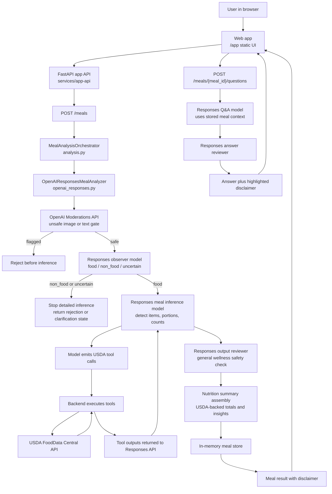

# Health Tech App

Local meal analyzer application centered around a FastAPI backend and a simple browser UI.

The primary experience is the web app served by the app API:

- `http://127.0.0.1:8000/app`

The web flow is image-first. It uses OpenAI APIs for upload safety, food relevance checks, meal-item extraction, and answer review, while the app backend owns USDA FoodData Central tool execution.

## Architecture



## Repository Layout

- `services/app-api`: main backend, web UI assets, OpenAI orchestration, USDA integration
- `services/app-api/src/app_api/static`: browser UI served at `/app`
- `services/nutrition-service`: legacy deterministic nutrition service scaffold
- `apps/mobile`: React Native scaffold, not the primary local testing surface
- `data`: local seed/reference data
- `scripts`: local startup and utility scripts

## Runtime Pipeline

Image analysis uses this sequence:

1. OpenAI Moderations API rejects unsafe image or text content before inference.
2. A low-cost Responses observer model classifies the upload as `food`, `non_food`, or `uncertain`.
3. Food uploads continue to the Responses meal inference model for item extraction, portion estimates, and counting.
4. The model requests USDA lookups through tool calls.
5. The app backend executes those USDA tool calls in Python and sends tool outputs back to the Responses API.
6. A Responses output reviewer checks the structured analysis for non-medical, general wellness language.
7. The app assembles USDA-backed nutrition totals, insights, per-stage timings, and the required disclaimer.

Follow-up meal questions use the stored meal analysis context, a Responses answer generation call, a Responses output safety review, and the same disclaimer.

## Important Files

- `services/app-api/src/app_api/api.py`: FastAPI routes and web app serving
- `services/app-api/src/app_api/analysis.py`: meal orchestration and nutrition summary assembly
- `services/app-api/src/app_api/openai_responses.py`: OpenAI calls, tool loop, output review, and Q&A
- `services/app-api/src/app_api/usda_client.py`: USDA FoodData Central client
- `services/app-api/src/app_api/policy.py`: upload validation rules
- `services/app-api/src/app_api/models.py`: shared models and disclaimer text
- `services/app-api/src/app_api/storage.py`: in-memory meal storage
- `services/app-api/src/app_api/static/index.html`: browser app markup
- `services/app-api/src/app_api/static/app.js`: browser app behavior
- `services/app-api/src/app_api/static/app.css`: browser app styling

## Configuration

Required for OpenAI-backed image analysis:

```bash
export OPENAI_API_KEY=your_key_here
```

Optional overrides:

```bash
export OPENAI_MEAL_MODEL=gpt-5.4-mini
export OPENAI_OBSERVER_MODEL=gpt-5.4-nano
export OPENAI_OUTPUT_REVIEW_MODEL=gpt-5.4-nano
export USDA_API_KEY=your_usda_key_here
```

When `OPENAI_API_KEY` is not set, the app API still starts, but image analysis is unavailable and the web UI shows that status.

## Local Development

Install Python service dependencies:

```bash
python3 -m pip install -r services/app-api/requirements.txt
python3 -m pip install -r services/nutrition-service/requirements.txt
```

Start the browser app:

```bash
sh start.sh web
```

Then open:

- `http://127.0.0.1:8000/app`

Other useful commands:

```bash
sh start.sh web-bg
sh stop.sh web
sh stop.sh all
npm run test:python
```

Useful endpoints:

- `/`
- `/health`
- `/docs`
- `/app`

## API Example

Send a meal image as base64 to `/meals`:

```json
{
  "filename": "meal.jpg",
  "mime_type": "image/jpeg",
  "size_bytes": 123456,
  "image_base64": "BASE64_IMAGE_BYTES",
  "text": "Lunch bowl with chicken and rice"
}
```

The response includes validation state, detected components, inferred meal items, USDA-backed nutrition context, stage timings, and this disclaimer:

> These meal-item detections are for general informational purposes only. They are not medical advice. All values are estimates, and actual quantities may vary.

## Safety Constraints

- Unsafe image or text content must be rejected before inference.
- Non-food uploads should not continue to detailed meal inference.
- Output must avoid medical advice, diagnosis, treatment guidance, medication advice, and disease-management claims.
- Every analysis result and follow-up answer must include the disclaimer.
- The disclaimer must state that values are estimates and actual quantities may vary.

## Verification

Primary verification command:

```bash
npm run test:python
```

When changing the web UI, also manually verify:

1. Image upload works at `/app`.
2. Stage timings render correctly.
3. Long text wraps inside cards.
4. Follow-up question output keeps the disclaimer highlighted.
